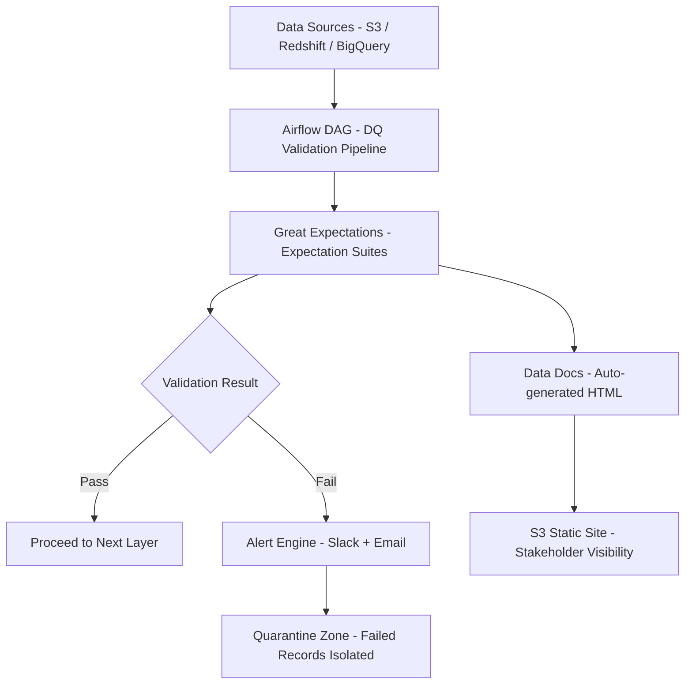

# Data Quality Pipeline — Great Expectations + Airflow


Enterprise-grade automated data quality pipeline using Great Expectations for validation and Apache Airflow for orchestration. Validates schema, distributions, freshness, referential integrity, and business rules across all data layers. Generates HTML data docs automatically.

## Architecture



## Expectation Suites

| Suite | Data Asset | Checks |
|-------|-----------|--------|
| `raw_orders` | Raw order data | Schema, nulls, ranges |
| `staging_customers` | Customer staging | Email format, uniqueness |
| `fct_revenue` | Revenue facts | Totals, referential integrity |
| `dim_products` | Product dimension | Category values, pricing |

## Features

- Great Expectations 0.18+ with new-style Checkpoints
- Airflow operators for GE validation steps
- Automatic Data Docs publishing to S3
- Slack alerting on validation failure
- Quarantine table pattern for bad records
- Statistical drift detection (distribution shifts)
- Row-level anomaly tagging

## Quick Start

```bash
git clone https://github.com/zulham-tech/data-quality-pipeline-great-expectations.git
cd data-quality-pipeline-great-expectations
docker compose up -d
great_expectations init
great_expectations checkpoint run orders_checkpoint
# Airflow: http://localhost:8080
```

## Project Structure

```
.
├── dags/                    # Airflow DAG definitions
├── validators/              # GE validation helpers
├── gx/
│   ├── expectations/        # Expectation suite JSON files
│   ├── checkpoints/         # Checkpoint configurations
│   └── data_docs/           # Generated HTML reports
├── quarantine/              # Bad record handling logic
├── alerts/                  # Slack + email alerting
├── docker-compose.yml
└── requirements.txt
```

## Author

**Ahmad Zulham Hamdan** — [LinkedIn](https://linkedin.com/in/ahmad-zulham-665170279) | [GitHub](https://github.com/zulham-tech)
